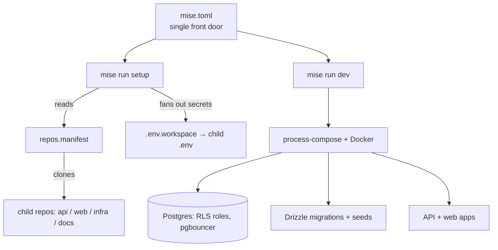

The most sophisticated ventures use a **workspace orchestrator**: a thin parent repo that owns only cross-cutting tooling and turns a set of independent child repos into a single, one-command local platform. GreekCore v2 is the fullest example.

## The single front door

`mise.toml` is the one entry point. It pins the toolchain (Node 22, pnpm 9.15.0, `process-compose`) and defines every dev task for every child repo. A clean clone goes:

<CodeGroup>
```bash Setup
mise run setup
```

```bash Dev
mise run dev
```
</CodeGroup>

## How the pieces fit



<CardGroup cols={2}>
  <Card title="repos.manifest" icon="list">
    Clones the independent GitHub repos (`api`, `web`, `infra`, `docs`) — gitignored, **not** submodules. The workspace owns only cross-cutting tooling.
  </Card>
  <Card title="process-compose + Docker" icon="container">
    Supervise local Postgres (RLS roles, pgbouncer), Drizzle migrations, and seeds, then launch the apps.
  </Card>
</CardGroup>

## Setup as a DAG

`mise run setup` and `mise run dev` enforce an ordered dependency graph rather than a flat script:

<Steps>
  <Step title="Clone & install">
    Read `repos.manifest`, clone missing repos, install node packages.
  </Step>
  <Step title="Fan out secrets">
    Distribute secrets from `.env.workspace` into each child's `.env`.
  </Step>
  <Step title="Bring up data">
    Health-check the Postgres container, then run migrations and seeds.
  </Step>
  <Step title="Build in order">
    Compile shared packages (`@greekcore/db`, `@greekcore/ui`, `@greekcore/auth-web`) in dependency order.
  </Step>
  <Step title="Launch">
    Start the API and web apps simultaneously under `process-compose`.
  </Step>
</Steps>

## Skills as pinned dependencies

`skills-lock.json` pins external agent skills by content hash — third-party skills are vendored and pinned just like package dependencies.

<CardGroup cols={2}>
  <Card title="Clerk skills" icon="key-round">
    Auth-related agent skills, content-pinned.
  </Card>
  <Card title="GetStream skills" icon="message-circle">
    `stream`, `stream-builder`, `stream-react`, `stream-docs` — pinned by hash.
  </Card>
</CardGroup>

<Tip>
  Pinning skills by content hash means an agent's available capabilities are reproducible and reviewable — the same idea as a lockfile, applied to agent tooling.
</Tip>

## Why this shape

<CardGroup cols={2}>
  <Card title="Thin workspace, real repos" icon="folder-tree">
    Child repos stay independently versioned and deployable; the workspace never becomes a monorepo bottleneck.
  </Card>
  <Card title="Zero-config onboarding" icon="zap">
    One `mise run setup && mise run dev` brings up the database, migrations, seeds, backend, and every frontend.
  </Card>
</CardGroup>
