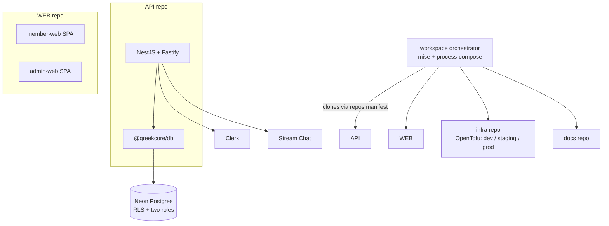

GreekCore is a multi-repo platform for Greek-life organizations (fraternities and sororities). It orchestrates the member directory, executive governance, financial operations, and real-time communications, with bulletproof database-level tenant isolation and automated multi-environment provisioning.

<CardGroup cols={2}>
  <Card title="Audience" icon="users">
    University chapters, national headquarters, and staff administrators.
  </Card>
  <Card title="Role" icon="user">
    Founding engineer — sole developer and architect of the v2 workspace, schemas, auth guards, IaC, and chat integration.
  </Card>
</CardGroup>

## Tech stack

- **Frontend:** TypeScript, React (Vite-powered SPA)
- **Backend:** NestJS on the Fastify adapter
- **Database:** Neon Serverless Postgres with Drizzle ORM
- **Infrastructure:** OpenTofu (IaC), Google Cloud Platform (Cloud Run, Secret Manager), Cloudflare (R2 storage, DNS)
- **Auth & realtime:** Clerk (authentication) and Stream Chat (messaging)

## Architecture

A hybrid multi-repo architecture orchestrated by a central workspace.

<CardGroup cols={2}>
  <Card title="API child repo" icon="server">
    A NestJS + Fastify backend and the shared `@greekcore/db` package.
  </Card>
  <Card title="Web child repo" icon="monitor">
    Two React SPAs: `member-web` (user/officer dashboard) and `admin-web` (staff portal).
  </Card>
  <Card title="Infrastructure child repo" icon="cloud">
    Manages dev, staging, and prod environments with OpenTofu.
  </Card>
  <Card title="Docs child repo" icon="book">
    Developer guides and schema documentation.
  </Card>
</CardGroup>

## Key primitives

<AccordionGroup>
  <Accordion title="Drizzle ORM & Neon Postgres" icon="database">
    A strict two-role database model with Postgres Row-Level Security (RLS) policies enforces multi-tenancy.
  </Accordion>
  <Accordion title="Clerk" icon="key-round">
    Handles user authentication, token verification, and profile hosting, validated statelessly via JWT signatures on request entry.
  </Accordion>
  <Accordion title="Stream Chat SDK" icon="message-circle">
    Backs the real-time messaging system with programmatically synced chapter and board channels.
  </Accordion>
</AccordionGroup>

## Onboarding speed

<CardGroup cols={2}>
  <Card title="Zero-config onboarding" icon="zap">
    A single `mise run setup && mise run dev` initializes and spins up the database, migration engine, seed script, API backend, and both React web apps.
  </Card>
  <Card title="End-to-end type safety" icon="badge-check">
    Fully typed API client interfaces are generated directly from backend DTO controllers, giving full type safety across the HTTP boundary.
  </Card>
</CardGroup>

<Card title="Read the architecture deep dive" icon="layers" href="/ventures/greekcore/architecture">
  RLS and the two-role split, the owner-bypassing bootstrap path, chat synchronization, and dev orchestration.
</Card>
